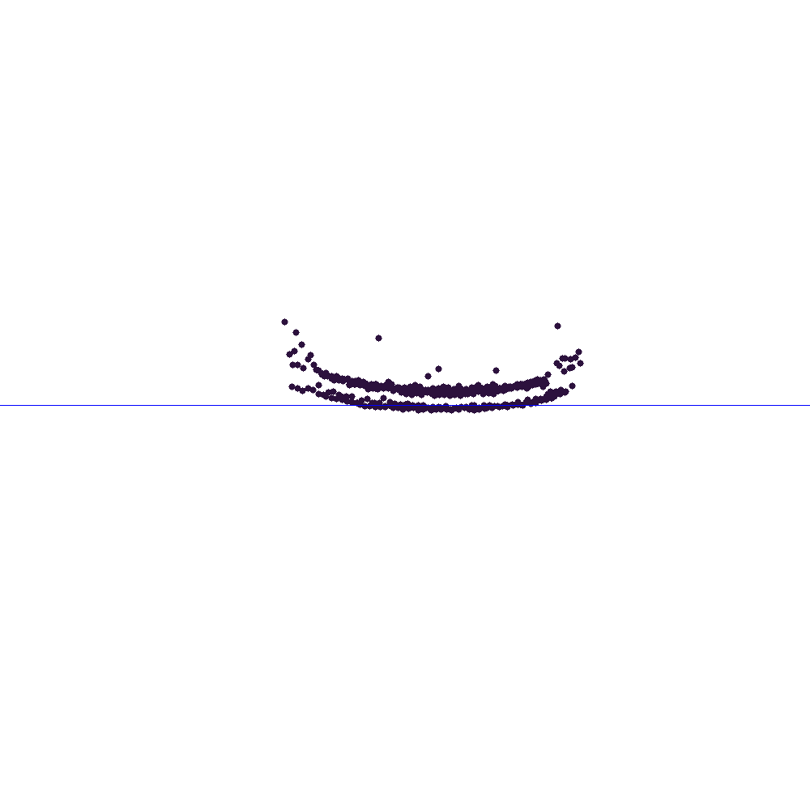
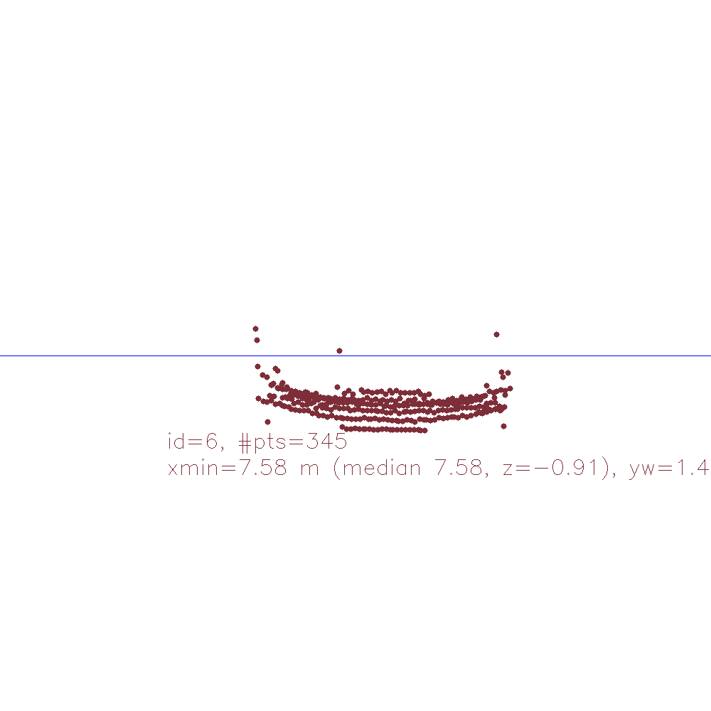
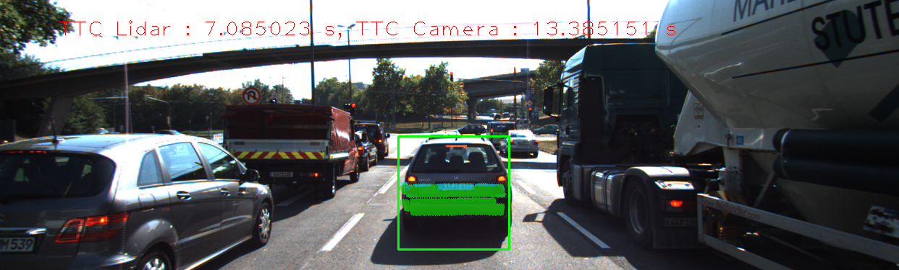
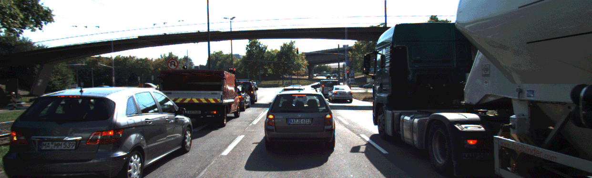
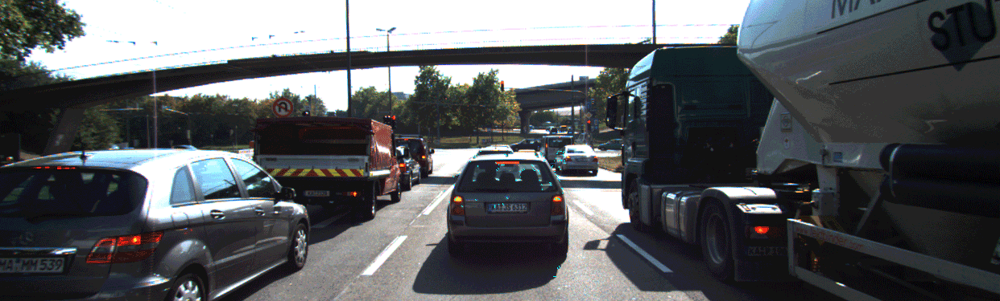

# SFND 3D Object Tracking

Welcome to the final project of the camera course. By completing all the lessons, you now have a solid understanding of keypoint detectors, descriptors, and methods to match them between successive images. Also, you know how to detect objects in an image using the YOLO deep-learning framework. And finally, you know how to associate regions in a camera image with Lidar points in 3D space. Let's take a look at our program schematic to see what we already have accomplished and what's still missing.

In this final project, you will implement the missing parts in the schematic. To do this, you will complete four major tasks: 
1. First, you will develop a way to match 3D objects over time by using keypoint correspondences. 
2. Second, you will compute the TTC based on Lidar measurements. 
3. You will then proceed to do the same using the camera, which requires to first associate keypoint matches to regions of interest and then to compute the TTC based on those matches. 
4. And lastly, you will conduct various tests with the framework. Your goal is to identify the most suitable detector/descriptor combination for TTC estimation and also to search for problems that can lead to faulty measurements by the camera or Lidar sensor. In the last course of this Nanodegree, you will learn about the Kalman filter, which is a great way to combine the two independent TTC measurements into an improved version which is much more reliable than a single sensor alone can be. But before we think about such things, let us focus on your final project in the camera course. 

## Dependencies for Running Locally
* cmake >= 2.8
  * All OSes: [click here for installation instructions](https://cmake.org/install/)
* make >= 4.1 (Linux, Mac), 3.81 (Windows)
  * Linux: make is installed by default on most Linux distros
  * Mac: [install Xcode command line tools to get make](https://developer.apple.com/xcode/features/)
  * Windows: [Click here for installation instructions](http://gnuwin32.sourceforge.net/packages/make.htm)
* Git LFS
  * Weight files are handled using [LFS](https://git-lfs.github.com/)
* OpenCV >= 4.1
  * This must be compiled from source using the `-D OPENCV_ENABLE_NONFREE=ON` cmake flag for testing the SIFT and SURF detectors.
  * The OpenCV 4.1.0 source code can be found [here](https://github.com/opencv/opencv/tree/4.1.0)
* gcc/g++ >= 5.4
  * Linux: gcc / g++ is installed by default on most Linux distros
  * Mac: same deal as make - [install Xcode command line tools](https://developer.apple.com/xcode/features/)
  * Windows: recommend using [MinGW](http://www.mingw.org/)

## Basic Build Instructions

1. Clone this repo.
2. Make a build directory in the top level project directory: `mkdir build && cd build`
3. Compile: `cmake .. && make`
4. Run it: `./3D_object_tracking`.

## Performance

Lidar animation

The preceding vehicle is getting closer at a steady rate with a few outlier points which were filtered out for distance calculation.
For almost all of the frames, the Z coordinate of the closest point is around -1.15. However at frame 6 and 7, there's an anomaly, the Z coordinate here is -0.91, which is on the license plate.

From the lidar point cloud, it seems like the license plate pops out, and the preceding vehicle is calculated to be 5 cm closer than it should be. It creates a big jump in the TTC calculation, which drops to 7.09 seconds.

At the next frame, this point cloud remains almost steady in air, creating a big TTC number of 47.28 seconds.

## Camera

ORB detector, BRIEF descriptor was one of the selected keypoint matching algorithm pair from the previous project. Frame 2 has a very high TTC value, 111.43. Here's an image with teal lines between matching points:

The ORB detector is limited to 1000 detected keypoints (instead of the default 500), but there're still too few keypoints on the preceding vehicle. Many of the keypoints are on the gray car in the right lane.

The FAST detector with BRIEF descriptor has very good performance. In frame 5, the TTC calculation jumped to 22.38 seconds:

There're a good amount of matches keypoints on the vehicle, but there're many on the car in the right lane.

The keypoints which are not on the preceding vehicle should be filtered out. Maybe cutting out the corners would help in this case, but the good solution would be to use semantic segmentation on the image to have better outlines.

Generally, the main problem is that the distances between keypoints are very small. The keypoints have to be very precisely centered on the same point to have reliable results. By taking the median distance ratio we minimized the effect of outliers in the result, but it doesn't help with the noise.

detector+descriptor| 1| 2| 3| 4| 5| 6| 7| 8| 9| 10| 11| 12| 13| 14| 15| 16| 17| 18
---|---|---|---|---|---|---|---|---|---|---|---|---|---|---|---|---|---|---
SHITOMASI+BRISK| 14.04| 12.76| 13.53| 11.97| 12.00| 13.67| 12.66| 13.28| 11.27| 13.50| 11.05| 11.53| 11.60| 11.22| 9.31| 11.02| 11.13| 8.73
SHITOMASI+BRIEF| 13.89| 12.84| 12.42| 13.57| 11.74| 13.78| 17.51| 12.22| 11.70| 13.30| 11.56| 11.63| 11.97| 11.65| 12.20| 10.67| 11.56| 7.83
SHITOMASI+ORB| 13.80| 12.94| 11.85| 12.13| 11.57| 13.79| 11.69| 12.13| 10.92| 13.48| 11.04| 11.52| 12.32| 11.52| 10.24| 11.85| 10.98| 8.27
SHITOMASI+FREAK| 13.46| 12.96| 11.04| 12.15| 11.91| 14.42| 12.53| 12.86| 12.10| 12.90| 11.05| 11.81| 12.13| 11.14| 10.25| 11.02| 11.15| 8.15
SHITOMASI+SIFT| 14.91| 13.15| 11.41| 12.85| 11.95| 13.29| 12.97| 12.56| 11.81| 13.41| 11.53| 11.62| 11.76| 11.36| 12.32| 11.61| 11.18| 9.97
HARRIS+BRISK| 8.75| inf| 811.28| 11.58| 17.80| 13.62| 11.38| 10.76| 10.62| inf| 11.67| 9.48| inf| 9.44| inf| 7.21| 10.15| inf
HARRIS+BRIEF| 11.46| inf| inf| 11.58| 13.37| 14.70| inf| 11.00| 10.62| -326.85| 22.80| 9.48| 26.91| 8.21| inf| 8.39| 9.35| 662.61
HARRIS+ORB| 11.46| inf| -161.69| 11.58| 13.16| 14.70| inf| 11.00| 10.62| -326.85| 11.74| 9.48| inf| 8.21| inf| 8.39| 9.20| 662.61
HARRIS+FREAK| 9.75| inf| inf| 12.13| 17.80| 13.90| inf| 10.03| 9.27| inf| 11.44| 8.63| 26.91| 9.44| inf| 8.69| 6.74| 8.25
HARRIS+SIFT| 11.46| inf| inf| 11.58| 13.27| 13.62| inf| 11.00| 10.62| -326.85| 22.80| 9.48| inf| 8.21| inf| 8.39| 8.57| 662.61
HARRIS_GFT+BRISK| 12.09| 11.31| 13.53| 26.87| 12.58| 13.19| 12.65| 33.70| 12.11| 13.87| 12.61| 12.02| 11.41| 12.38| 9.22| 12.85| 9.81| 12.74
HARRIS_GFT+BRIEF| 11.95| 11.59| 16.63| 22.07| 12.41| 12.67| 13.22| 21.87| 12.24| 14.16| 12.91| 11.99| 11.92| 12.06| 9.75| 12.36| 10.79| 13.50
HARRIS_GFT+ORB| 11.95| 11.68| 18.91| 17.89| 12.22| 12.85| 12.97| 13.84| 12.07| 14.22| 12.79| 11.99| 11.79| 12.72| 9.91| 12.92| 10.76| 13.36
HARRIS_GFT+FREAK| 12.29| 11.84| 13.31| 17.94| 10.77| 13.85| 12.42| 13.73| 12.40| 12.64| 12.89| 12.59| 11.26| 11.57| 9.48| 11.14| 10.43| 12.05
HARRIS_GFT+SIFT| 12.47| 11.66| 14.86| 23.56| 11.81| 12.67| 13.19| 27.42| 12.24| 13.28| 12.91| 11.99| 11.92| 12.72| 9.75| 12.36| 10.69| 12.72
FAST+BRISK| 12.52| 12.50| 12.82| 12.89| 606.99| 12.97| 11.81| 11.23| 11.93| 13.53| 12.94| 12.02| 11.78| 11.41| 11.37| 11.96| 9.19| 11.76
**FAST+BRIEF**| 11.23| 12.35| 13.58| 13.63| 22.38| 13.39| 12.04| 11.91| 13.41| 13.37| 14.37| 11.60| 12.00| 11.40| 11.78| 12.60| 8.24| 11.34
**FAST+ORB**| 12.07| 11.38| 13.19| 13.70| 21.90| 12.95| 12.34| 11.54| 12.98| 14.15| 13.95| 11.49| 12.14| 10.92| 10.87| 11.49| 10.01| 11.82
FAST+FREAK| 11.93| 14.94| 12.89| 13.84| 77.30| 12.33| 12.09| 11.44| 12.39| 13.66| 13.00| 11.93| 11.61| 11.11| 10.78| 11.94| 8.85| 11.78
FAST+SIFT| 12.05| 13.08| 16.19| 14.94| 34.15| 13.16| 12.03| 12.06| 13.36| 13.78| 14.40| 11.51| 12.56| 11.49| 11.40| 12.26| 7.75| 10.39
BRISK+BRISK| 13.48| 23.02| 14.26| 15.66| 29.40| 18.97| 17.02| 16.90| 13.96| 13.39| 12.89| 11.11| 11.85| 12.16| 12.65| 11.37| 9.27| 11.17
BRISK+BRIEF| 13.81| 18.99| 13.11| 19.45| 20.27| 17.96| 16.05| 18.33| 15.69| 12.88| 13.81| 14.62| 12.30| 11.70| 11.10| 13.28| 11.34| 11.04
BRISK+ORB| 15.57| 18.64| 14.30| 17.11| 21.08| 20.19| 17.92| 16.70| 14.46| 11.31| 13.54| 11.61| 11.66| 12.41| 11.25| 11.58| 10.30| 12.10
BRISK+FREAK| 12.67| 23.40| 13.77| 14.24| 24.32| 18.28| 15.37| 17.86| 15.33| 14.04| 13.74| 11.56| 11.74| 11.27| 12.55| 10.12| 9.22| 10.81
BRISK+SIFT| 13.71| 16.41| 17.90| 12.23| 37.85| 16.56| 13.91| 15.94| 16.83| 14.08| 14.87| 10.81| 13.68| 11.51| 13.72| 10.77| 10.91| 11.74
ORB+BRISK| 12.50| 19.39| 19.40| 19.27| 77.32| 11.72| 12.40| 18.17| 11.19| 13.48| 10.20| 42.88| 10.34| 8.94| 12.43| 11.42| 10.68| 15.86
**ORB+BRIEF**| 15.85| 111.43| 23.64| 17.43| 17.39| 12.35| 13.38| 16.27| 14.22| 11.87| 12.10| 12.72| 11.27| 13.08| 10.74| 13.58| 11.24| 11.80
ORB+ORB| 20.13| 2922.86| 13.90| 13.97| 19.03| inf| 19.96| 13.63| 12.87| 25.03| 10.79| inf| 12.18| 11.21| 13.70| 10.19| 11.58| 12.01
ORB+FREAK| 10.24| 47.92| 13.87| 11.88| 3028.38| 17.84| 12.61| 15.00| 11.62| 838860.81| 9.59| 12.93| 9.13| 9.95| 10.12| 10.61| 10.26| 11.29
ORB+SIFT| 10.80| 22.57| 12.34| 45.90| 30.39| 19.60| 13.69| 14.91| 11.31| 12.48| 10.18| 13.23| 9.60| 8.94| 13.19| 8.40| 12.25| 11.87
AKAZE+BRISK| 11.93| 15.32| 13.37| 14.47| 14.92| 15.04| 15.94| 13.98| 13.97| 11.95| 12.41| 10.37| 10.11| 10.02| 10.24| 10.43| 9.64| 8.87
AKAZE+BRIEF| 13.38| 14.86| 13.71| 13.88| 15.32| 14.15| 15.82| 14.13| 13.75| 11.61| 12.59| 11.54| 10.10| 9.88| 9.96| 10.15| 9.64| 9.35
AKAZE+ORB| 12.45| 14.42| 13.23| 14.46| 15.71| 14.08| 15.78| 14.15| 13.45| 11.59| 12.50| 11.63| 10.12| 10.40| 10.43| 10.19| 9.14| 9.25
AKAZE+FREAK| 12.37| 14.07| 13.96| 14.04| 16.05| 14.61| 15.47| 13.71| 13.22| 11.97| 12.23| 10.85| 10.85| 9.86| 9.72| 10.51| 9.11| 8.75
AKAZE+AKAZE| 12.36| 14.11| 12.94| 14.34| 16.64| 14.14| 15.35| 14.21| 13.96| 11.58| 12.17| 11.19| 11.08| 10.56| 10.26| 10.12| 9.13| 8.94
AKAZE+SIFT| 12.42| 14.53| 13.27| 14.22| 16.51| 14.23| 15.70| 13.83| 13.95| 11.82| 12.31| 11.20| 10.79| 10.52| 10.24| 9.98| 9.03| 9.08
SIFT+BRISK| 12.01| 13.10| 13.40| 18.75| 15.39| 11.46| 14.38| 15.28| 13.14| 11.35| 12.81| 10.38| 9.42| 9.63| 9.49| 8.43| 9.42| 9.39
SIFT+BRIEF| 12.10| 13.38| 14.88| 20.12| 14.51| 12.07| 15.82| 16.11| 13.05| 10.66| 12.06| 10.21| 9.43| 9.93| 10.11| 8.67| 8.69| 8.84
SIFT+FREAK| 11.57| 13.82| 13.54| 20.12| 14.92| 11.94| 14.87| 13.54| 14.31| 11.38| 12.12| 10.46| 10.02| 9.77| 9.18| 8.69| 8.95| 9.50
SIFT+SIFT| 11.77| 12.61| 12.93| 18.74| 12.77| 11.09| 13.64| 14.90| 13.21| 10.84| 11.26| 11.27| 9.45| 10.28| 9.80| 8.87| 8.66| 8.78
Lidar| 13.89| 11.55| 18.16| 12.50| 13.03| 7.09| 47.28| 20.91| 12.88| 14.84| 10.35| 9.97| 9.11| 11.51| 8.01| 8.94| 9.58| 8.63
